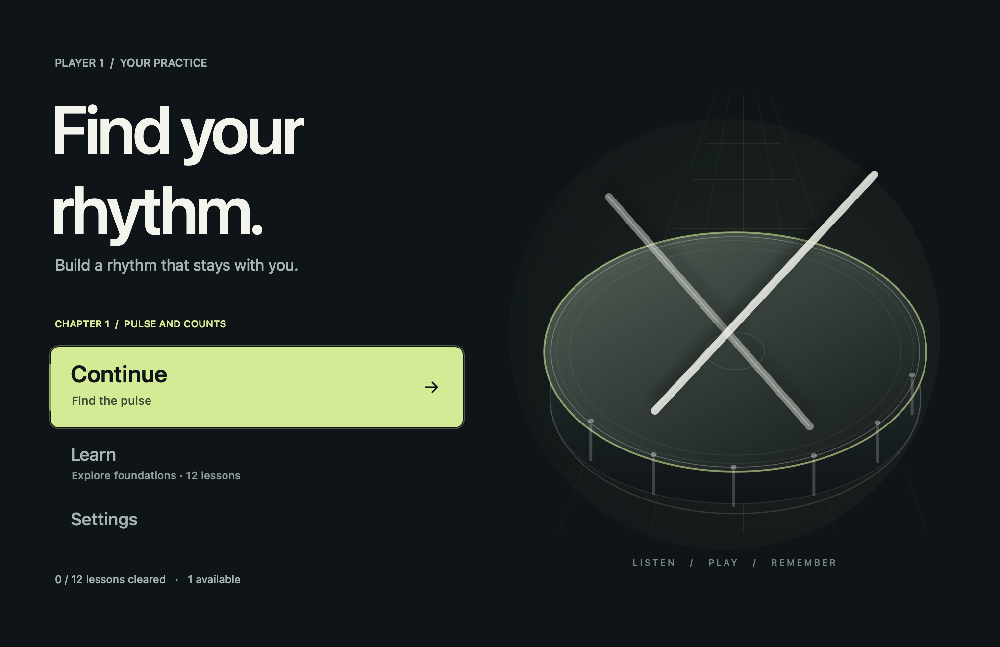
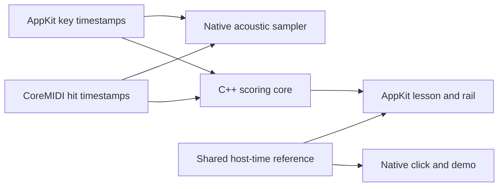

# drumx

**Learn the groove. Keep it when the notes disappear.**

Drumx is a desktop trainer for real MIDI drum kits: the pull of a rhythm game, built around listening, counting, and learning to play without the screen.

Start with **Find the pulse**, then work through **12 foundation lessons**: count quarter and eighth notes, give rests their space, combine hands and feet, build a backbeat, and return to one after a short fill. Every lesson connects real drum notation, recorded drum sounds, and the same focused practice highway.

**Current build:** a playable native macOS app with a responsive main menu, a 12-step lesson path, lesson unlocks, visual kit setup, separate local players, and saved progress. Practice starts with an uninterrupted **16-bar block**, about a minute at the foundation tempos. The unit suggests **96 minutes of repeat practice**, taken at your pace across listening, playing, checks, and recall. A release installer, deeper rudiments, the production renderer, and a player-ready Windows release are still ahead.

[Run it](#quick-start) · [Current milestone](#current-milestone) · [Lesson guide](docs/native-lab.md) · [Changelog](CHANGELOG.md)



*Native main menu, rendered with a sample player.*

## Current milestone

**M0 achieved: the game mechanics and UI concept. M1 active: one complete beginner learning journey.**

The prototype established the shared timing line, stable kit layout, capture feedback, sound, guidance modes, and practice/review loop. We have an accepted concept to build on. Physical-kit latency, sustained frame pacing, and release readiness still need evidence.

The active milestone is a player outcome: **a new drummer can connect their kit, learn a small foundation unit, try it with less help, and return knowing what to practise next.** Welcome, course selection, teaching, practice, review, and local progress are now connected. The next evidence comes from using the whole course with a beginner and a physical kit.

**Active slice: coached pulse, with a visual-quality gate.** Find the pulse now chooses a 60 BPM opening, suggests 66 and 72 BPM from completed takes, and separates its 72 BPM checkpoint from optional faster challenges and recall. Coached and free-practice choices save independently. The native Mac and experimental shared apps use the same [tempo policy](docs/guided-tempo.md). The next gate is a complete kit-connected playtest plus visual inspection of preparation, gameplay, review, and resizing on both systems. The other 11 lessons retain their existing practice and unlock rules. The [coached-pulse playtest](docs/coached-pulse-playtest.md) defines the next review and its exit criteria.

**Active quality gate: [a premium 30-minute practice session](docs/premium-quality-gate.md).** The current pass covers every existing screen, control state, navigation route, resize, feedback mode, and recovery path. It closes with zero blocking or major issues, an observed complete session, rendered Mac/Windows comparisons, and verified paired packages. **Status: open.** Interactive visual review, frame-pacing measurement, and physical-kit testing remain required.

**This polish pass:** clearer settings values and pad states, shorter-window scrolling, deliberate keyboard focus, and a return route from Settings. Completed results wait for a successful save before affecting records or unlocks; interrupted input/audio requires an explicit recovery. The current visual composition and musical timeline remain the baseline for review.

**Quality bar: a small, finished game that could belong on Steam.** The first unit should feel deliberately designed from launch through the return visit: clear onboarding, cohesive visuals and sound, responsive play, satisfying feedback, and dependable recovery. Steam distribution and possible paid release are aspirations to evaluate; availability, pricing, and a source-code license are not decided.

| Milestone | Status | What the player gains |
| --- | --- | --- |
| **M0 · Mechanics and UI concept** | Achieved | Hear, play, capture, review, and retry a short backbeat on a consistent highway. |
| **M1 · Complete beginner journey** | **Working towards** | Set up, find a starting point, learn pulse/counts/backbeat in small steps, review, and resume. |
| **M2 · Rudiments and reading** | Planned | Learn named singles, doubles, and paradiddles through counts, notation, and coordination. |
| **M3 · Retention and independence** | Planned | Build on early memory checks with later revisits, targeted practice, and variations. |
| **M4 · Musical application** | Planned | Use the vocabulary in grooves, fills, dynamics, and intermediate coordination. |

### What closes M1

- [ ] **A confident first setup:** verify the kit's pads, sound route, and basic timing; recover clearly from a disconnected input.
- [x] **A starting point for each player:** separate local profiles, practice archives, checks, and resume settings; legacy history stays with the first player.
- [x] **One coherent foundation unit:** 12 original lessons build pulse, counts, rests, coordination, the backbeat, variations, and a short fill using real notation.
- [ ] **A useful learning checkpoint:** check counting/reading, repeat the pattern, and attempt it with less guidance. Keep technique self-checks separate from MIDI evidence.
- [ ] **An intentional next step:** review explains one useful adjustment and recommends practice or progression from the player's evidence.
- [x] **A complete return journey:** verified close/reopen with the selected player, lesson, eight-bar settings, saved takes, and independent reading evidence intact.
- [ ] **A polished complete experience:** inspect launch, setup, lesson selection, count-in, play, review, retry, and return as one flow, including empty states, interruptions, readable feedback, reduced motion, and supported window sizes.
- [x] **A reusable lesson foundation:** versioned content drives shared teaching, audio, notation, scoring, and progress. Tests compare the authored targets and rendered audio across all 12 lessons.
- [ ] **An observed end-to-end run:** a beginner completes setup → lesson → practice → review → next step → return without developer intervention, including a documented real-kit session.

Checked items have implementation and verification evidence. The remaining acceptance gates keep M1 active. A bigger lesson list or five-star run alone does not close the milestone. Stars reward a take; learning gates describe readiness using timing, reading, recall, and the evidence MIDI cannot provide.

[Learning definitions and gates](docs/learning-milestones.md) specify the shared terms, evidence, and boundaries behind this roadmap. Reliability, accessibility, and distribution run alongside the learning milestones; a public preview need not wait for the intermediate course. We close each milestone with a demonstrated journey, relevant checks, known limitations, and an updated README and changelog.

## A foundation worth practising

| Chapter | What you work on |
| --- | --- |
| **1 · Pulse and counts** | Snare pulse, hi-hat eighth notes, snare rests, and bass-drum placement. |
| **2 · Build your backbeat** | Hand/foot coordination, hat/snare coordination, the full groove, and a quarter-note variation. |
| **3 · Read, vary, and remember** | Alternating hands, an offbeat kick, counting through a gap, and a groove-to-fill phrase. |

Each lesson offers a clear objective, counts, a staff study, an audible demonstration, repeatable practice blocks, a reading question, and a technique self-check. Find the pulse offers a coached 16-bar plan and an explicit **Free practice** route for manual tempo and assistance. Other lessons start at their suggested tempo with 16 bars; **Practice options** opens tempo, phrase length, guidance, and live timing. Suggested minutes are practice guidance, not a timer or a promise of learning speed.

**Learn** shows one featured step and a numbered path through three chapters. Inspect any of the 12 steps, then play an available lesson; locked steps explain what opens them. A new player opens the second lesson by completing the **72 BPM guided pulse checkpoint**: two qualifying takes among three comparable full phrases, with at least 16 bars, 95% of targets hit, 90% within ±50 ms, and no more than 2% extras. Existing unlocked lessons stay available. Subsequent lessons retain the prototype four-bar/80%-matched rule; entering a new chapter also requires the preceding lesson's reading check. One-bar repair and five-star scores remain useful without substituting for the checkpoint. These thresholds are product hypotheses to test with learners, not teaching standards.

| You can do this now | What it teaches |
| --- | --- |
| **Hear the pattern** | Listen to the selected lesson's acoustic drum demonstration and count along. |
| **Read, then play** | Connect a one-bar staff study and sticking suggestions to a shared timing line. |
| **Hide a phrase** | Alternate guided and hidden bars, then try a click-only take. |
| **Catch the note** | Fixed bottom receptors react to every strike, capture matched notes, and distinguish extra hits when live feedback is on. |
| **Follow a coached pace** | In Find the pulse, see why a pace was chosen, repeat it, try the checkpoint directly, or move into hidden-bar and click-only practice. |
| **Make one adjustment** | Review hits, misses, extras, and recent early/late tendencies; follow the pulse recommendation or choose free practice. |
| **Chase a clean phrase** | Earn up to five stars and 10,000 points; build a combo, then compare the last six matching takes and your previous best. |
| **Use your own kit** | Select a MIDI input, see raw notes and velocity, add pad aliases, and choose app sounds or your module's sounds. |
| **Return to your practice** | Continue the selected player's lesson with saved tempo, phrase length, and guidance. Reading and recall evidence stay separate. |

The main menu gives each visit three clear routes: **Continue** opens your saved lesson, **Learn** explores the course, and **Settings** configures the kit, sound, playing preferences, and players. The [menu architecture](docs/menu-architecture.md) explains how this grows into multiple courses and a separate practice space when those experiences exist.

The foundation unit plays **hi-hat, snare, and kick**. Seven stable hand-instrument positions and a full-width kick bar establish the visual layout; the other kit positions are reserved for future exercises.

Five stars mean a complete take with every target within the current ±50 ms timing band and no misses or extras. Points use the whole phrase, so an early streak cannot finish the challenge. Click-only practice reveals its score after the phrase. [Scoring and comparisons](docs/native-lab.md#scores-and-saved-attempts) describe the tiers and saved conditions; a perfect game result is evidence about that take, not a technique or mastery certificate.

Stars on **Learn** show your best saved result for that lesson version, with its pace and assistance displayed. This may come from any tempo, phrase length, or assistance. The review's personal best and comparison strip use matching practice conditions.

**Cross-platform work runs alongside the Mac app:** the C++ scoring core and C API consumer passed Debug/Release checks on macOS and Windows, plus Mac sanitizers, in the [first hosted CI run](https://github.com/claudfuen/drumx/actions/runs/34710014677). An [experimental native MIDI/audio bridge](apps/game/native/README.md) also builds and passes its Mac checks. The first shared interface failed visual review; the working Mac app remains the presentation baseline. The [experimental desktop workflow](.github/workflows/desktop-preview.yml) builds and tests both exported apps as CI artifacts, with automatic public release disabled during recovery. [Recovery scope and acceptance gates](docs/desktop-preview.md) keep known gaps explicit. The [first paired app run](https://github.com/claudfuen/drumx/actions/runs/34713214121) passed exported-app execution on both operating systems. Visual parity at matching display sizes and physical-kit testing remain open gates. [Platform contracts and early risks](docs/cross-platform.md)

## Experimental desktop test builds

The shared port is under regression review. The native Mac app above remains the primary experience. These coached-pulse packages come from commit `21e709f`; both exported executables passed 7,900 checks on their target operating systems in the [verified paired run](https://github.com/claudfuen/drumx/actions/runs/34715829432). The same run passed 57 native Swift coaching checks and compiled the native Mac app.

| Platform | Test package |
| --- | --- |
| Apple Silicon Mac | [Download Mac ARM64 artifact](https://github.com/claudfuen/drumx/actions/runs/34715829432/artifacts/10304249452) |
| Windows 64-bit | [Download Windows x64 artifact](https://github.com/claudfuen/drumx/actions/runs/34715829432/artifacts/10304449042) |

GitHub requires sign-in for artifacts and retains these for 14 days. Open the downloaded artifact ZIP, then extract the enclosed Drumx ZIP completely. Public releases remain on hold while visual parity and physical-kit testing are incomplete. The port uses a separate progress store and still lacks some native Mac features. Read the [inspection guide and known gaps](docs/desktop-preview.md) before testing.

## Quick start

Requires **macOS 15+**, **full Xcode**, and **Python 3** as `python3`. The script selects `/Applications/Xcode.app` when present and builds for your Mac's architecture. Command Line Tools alone are not supported.

```sh
git clone https://github.com/claudfuen/drumx.git
cd drumx
bash scripts/build-macos-lab.sh
open .build/DrumxLab.app
```

No MIDI kit is required to try the lesson:

1. Enter a player name on the welcome page, then choose **Let's play** to reach the main menu.
2. Choose **Continue** to open **Find the pulse**, or **Learn** to inspect the lesson path. Read the counts and choose **Hear the pattern**.
3. Follow the primary coached-pace action and come in after the four-beat count-in. A new player starts Find the pulse at 60 BPM for 16 bars. **Free practice** provides manual choices; other lessons use **Practice options**.
4. Read the review and its recommended next action, or repeat the same pace. Free practice offers manual slower/repair choices. Use **Lesson check** to connect the pattern to drum language.
5. When comfortable, try **Hide a phrase**, then **Try click-only**, or open **Next lesson** when unlocked. A locked next step explains what remains. **Main menu** returns to Continue, Learn, and Settings.

Try five minutes of listening, playing, and reviewing first. A 16-bar block lasts 64 seconds at 60 BPM or about 53 seconds at 72 BPM, plus the count-in. It ends in review; there is no endless automatic loop. Your completed attempts are archived on this Mac and the course remembers your reading and practice evidence. Add another local player from the player button to keep their progress separate.

| Control | Action |
| --- | --- |
| **A** | Hi-hat |
| **S** | Snare |
| **Space** | Kick |
| **Shift + key** | Softer strike |
| **↑ / ↓** | Choose Continue, Learn, or Settings on the main menu |
| **Enter** | Activate the selected menu action; start/retry from a lesson; restart from pause |
| **Esc** | Close a check/player sheet first; pause active playing/listening; otherwise return to the main menu after welcome |
| **Cmd + ,** | Open Settings while no phrase is running |
| **Settings** | Your kit, Sound, Playing, and Players & progress |

Pause stops the current phrase. **Restart with count-in** begins it again; it does not resume in the middle of a bar. An unfinished take does not change personal bests or unlock a lesson.

For a physical kit, open **Settings → Your kit**, choose its MIDI source, and strike the hi-hat, snare, and kick. The visual kit shows receipts and raw MIDI notes, including unmapped input. Select a pad and use **Add MIDI note** when needed. **Sound** controls app monitoring and volume. Follow the [first-kit session](docs/first-kit-session.md) for the hardware checks.

**Settings → Playing → Navigate with my drums** optionally maps hi-hat to previous, snare to next, and two quick kick hits to choose. It works on the main menu, lesson preparation, review, and pause. Use keyboard or mouse for Learn, Settings, and setup; drum-menu commands are inactive during playing and listening. The [lesson guide](docs/native-lab.md) covers the full controls and sound route.

## Sound and timing

The acoustic kit has **24 recorded hits: four velocity layers and two alternate takes per instrument**, from Karoryfer's Big Rusty Drums, bundled under CC0 with [license and provenance](native/assets/BigRusty/README.md).

Audio and grading follow captured time. Drawing presents the result.



The click and demo use native audio scheduling. MIDI monitoring bypasses the UI thread. Scoring retains captured timestamps, so a slow frame can delay feedback without becoming the player's timing error.

The Mac stack is **Swift/AppKit + CoreMIDI + AVAudioEngine**, with a **portable C++17 core and C interface**. The custom interface is built on AppKit; it is not a shared Windows UI. The authored lesson and progression models are currently Swift and need extraction or porting alongside Windows input/audio layers. Physical latency and sustained frame pacing still need hardware measurements. Choose the production engine before large content expansion; the [rendering plan](docs/rendering-plan.md) records the next experiment.

## Development

Versioned foundation exercises live in [DrumxCourse.swift](native/macos/DrumxCourse.swift). Custom charts feed the portable core and the native demonstration renderer from the same quarter-note beat data. [Local progress](native/macos/DrumxProgress.swift) separates player identities, resume settings, and reading/technique evidence; existing practice history belongs to the first player on upgrade.

```sh
bash scripts/test-native.sh
```

The native checks exercise scoring boundaries, simultaneous notes, late input, MIDI parsing and virtual input, kit mapping, menu gestures, practice-plan migration, sample integrity, audio/demo behavior, projection and count-in continuity, comparable lesson history, and unlock sequencing. They validate software behavior, not physical pad-to-sound latency. The [portable build guide](docs/cross-platform.md#build-and-test) runs the C++ and C contracts without the Mac app.

Start with the [scoring interface](native/core/drumx_core.h), [journey controller](native/macos/DrumxJourneyController.swift), [practice drawing](native/macos/PracticeView.swift), [notation](native/macos/DrumxNotationView.swift), or [review/history model](native/macos/DrumxLesson.swift).

See [troubleshooting](docs/native-lab.md#troubleshooting) for setup help. Builds are locally ad-hoc signed; quit and reopen after rebuilding. There is no notarized release download yet.

## Where this goes next

The active focus is **M1, the complete beginner journey**. The foundation course is playable; real-kit validation, beginner observation, sustained practice feedback, and further experience polish remain open. The broader rudiment course remains a draft.

- [Learning definitions and gates](docs/learning-milestones.md): the milestone contract and evidence for progression.
- [Menu architecture](docs/menu-architecture.md): current navigation, future course collections, and the boundary between learning and free practice.
- [Product pitch](docs/pitch.md): the learning experience and its scope.
- [Curriculum](docs/curriculum.md) and [lesson data draft](docs/lessons-draft.json): real drum language and planned progression.
- [Product research](docs/product-research.md): learning tools, rhythm games, and their tradeoffs.
- [Architecture options](docs/architecture-options.md) and [rendering plan](docs/rendering-plan.md): engineering choices and experiments.

See [working instructions](AGENTS.md) for the milestone and documentation workflow. Prefer small, playable milestones with relevant checks. Bug reports should include macOS version, input/module, settings, and reproduction steps. Timing proposals should explain what was measured and how.

## Licensing

A project-wide source-code license has not been selected yet. The bundled Big Rusty samples have their own **CC0** license, retained with the assets. External research links and PAS references do not grant redistribution rights to their charts, recordings, or song content.
