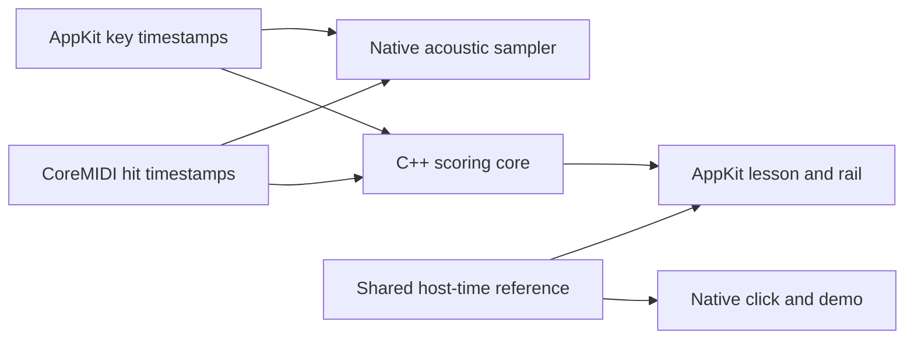

# drumx

**Learn the groove. Keep it when the notes disappear.**

Drumx is a desktop trainer for real MIDI drum kits: the pull of a rhythm game, built around listening, counting, and learning to play without the screen.

The first playable lesson is **Your first backbeat**. Read its drum notation, hear the groove, then play four short bars. Keep the hi-hat moving, put the snare on 2 and 4, and gradually remove the guide.

**Current build:** one playable native macOS lesson. Free public distribution is the goal; the larger course, production renderer, and Windows version are still ahead.

[Run it](#quick-start) · [Lesson guide](docs/native-lab.md) · [Product direction](docs/pitch.md) · [Changelog](CHANGELOG.md)

## A small lesson worth repeating

| You can do this now | What it teaches |
| --- | --- |
| **Hear the groove** | Listen to an acoustic drum demonstration and count `1 & 2 & 3 & 4 &`. |
| **Read, then play** | Connect a one-bar staff study and sticking suggestions to a shared timing line. |
| **Hide a phrase** | Alternate guided and hidden bars, then try a click-only take. |
| **Catch the note** | Fixed bottom receptors react to every strike, capture matched notes, and distinguish extra hits when live feedback is on. |
| **Make one adjustment** | Review hits, misses, extras, and recent early/late tendencies; retry slower or work on one bar. |
| **Beat a comparable result** | Complete takes are saved locally; personal bests compare matching settings and aids. |
| **Use your own kit** | Select a MIDI input, learn pad mappings, and choose app sounds or your module's sounds. |

The lesson plays **hi-hat, snare, and kick**. Seven stable hand-instrument positions and a full-width kick bar establish the visual layout; the other kit positions are reserved for future exercises.

## Quick start

Requires **macOS 15+**, **full Xcode**, and **Python 3** as `python3`. The script selects `/Applications/Xcode.app` when present and builds for your Mac's architecture. Command Line Tools alone are not supported.

```sh
git clone https://github.com/claudfuen/drumx.git
cd drumx
bash scripts/build-macos-lab.sh
open .build/DrumxLab.app
```

No MIDI kit is required to try the lesson:

1. Choose **Hear the groove** and count along.
2. Select a comfortable tempo, choose **Start playing**, and come in after the four-beat count-in.
3. Read the review. Try **Play again**, **Slow it down**, or **Work on one bar**.
4. When the groove feels familiar, choose **Hide a phrase**, then **Try click-only**.

Spend five minutes repeating these short takes. This is not a timed five-minute lesson: a four-bar take lasts ten seconds at the default 96 BPM, plus the count-in.

| Control | Action |
| --- | --- |
| **A** | Hi-hat |
| **S** | Snare |
| **Space** | Kick |
| **Shift + key** | Softer strike |
| **Enter** | Start or retry a take |
| **Esc** | Stop playing or listening; close setup |
| **Kit & sound** | MIDI input, pad mapping, sound, volume, sticking hints, and input offset |

For a physical kit, open **Kit & sound**, choose its MIDI source, and check each pad before playing. The [lesson guide](docs/native-lab.md) covers setup and sound routing.

## Sound and timing

The acoustic kit has **24 recorded hits: four velocity layers and two alternate takes per instrument**, from Karoryfer's Big Rusty Drums, bundled under CC0 with [license and provenance](native/assets/BigRusty/README.md).

Audio and grading follow captured time. Drawing presents the result.



The click and demo use native audio scheduling. MIDI monitoring bypasses the UI thread. Scoring retains captured timestamps, so a slow frame can delay feedback without becoming the player's timing error.

The stack is **Swift/AppKit + CoreMIDI + AVAudioEngine**, with a **portable C++17 core and C interface**. Physical latency and sustained frame pacing still need hardware measurements. See the [rendering plan](docs/rendering-plan.md) for the next experiment; the production engine remains undecided.

## Development

```sh
bash scripts/test-native.sh
```

The native checks exercise scoring boundaries, simultaneous notes, late input, MIDI parsing and virtual input, sample integrity, audio/demo behavior, projection and count-in continuity, and comparable lesson history. They validate software behavior, not physical pad-to-sound latency.

Start with the [scoring interface](native/core/drumx_core.h), [lesson controller](native/macos/DrumxLab.swift), [practice drawing](native/macos/PracticeView.swift), or [review/history model](native/macos/DrumxLesson.swift).

See [troubleshooting](docs/native-lab.md#troubleshooting) for setup help. Builds are locally ad-hoc signed; quit and reopen after rebuilding. There is no notarized release download yet.

## Where this goes next

Next: validate real-kit timing, improve rendering, and expand into named rudiments, accents, reading, and musical application. The curriculum remains a draft; timing scores alone do not establish mastery.

- [Product pitch](docs/pitch.md): the learning experience and its scope.
- [Curriculum](docs/curriculum.md) and [lesson data draft](docs/lessons-draft.json): real drum language and planned progression.
- [Product research](docs/product-research.md): learning tools, rhythm games, and their tradeoffs.
- [Architecture options](docs/architecture-options.md) and [rendering plan](docs/rendering-plan.md): engineering choices and experiments.

See [working instructions](AGENTS.md) for the milestone and documentation workflow. Prefer small, playable milestones with relevant checks. Bug reports should include macOS version, input/module, settings, and reproduction steps. Timing proposals should explain what was measured and how.

## Licensing

A project-wide source-code license has not been selected yet. The bundled Big Rusty samples have their own **CC0** license, retained with the assets. External research links and PAS references do not grant redistribution rights to their charts, recordings, or song content.
