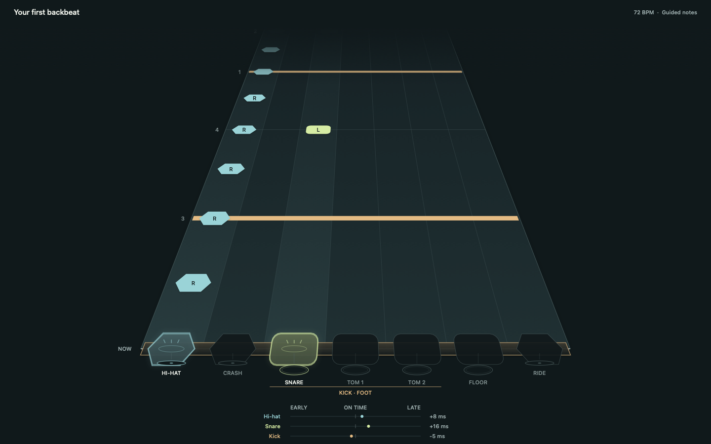
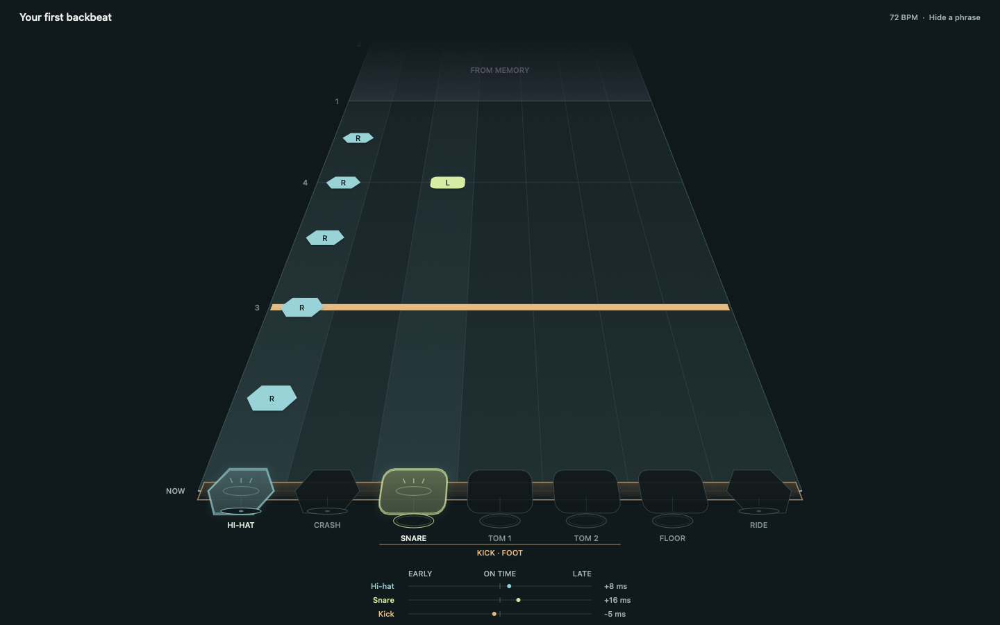
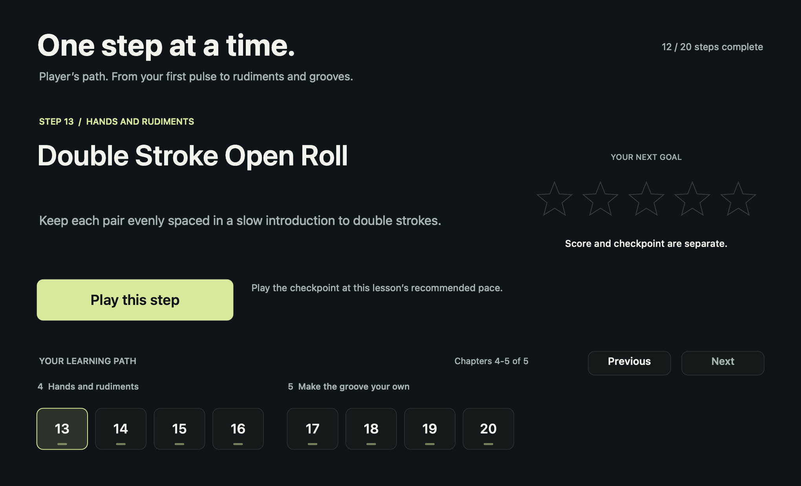
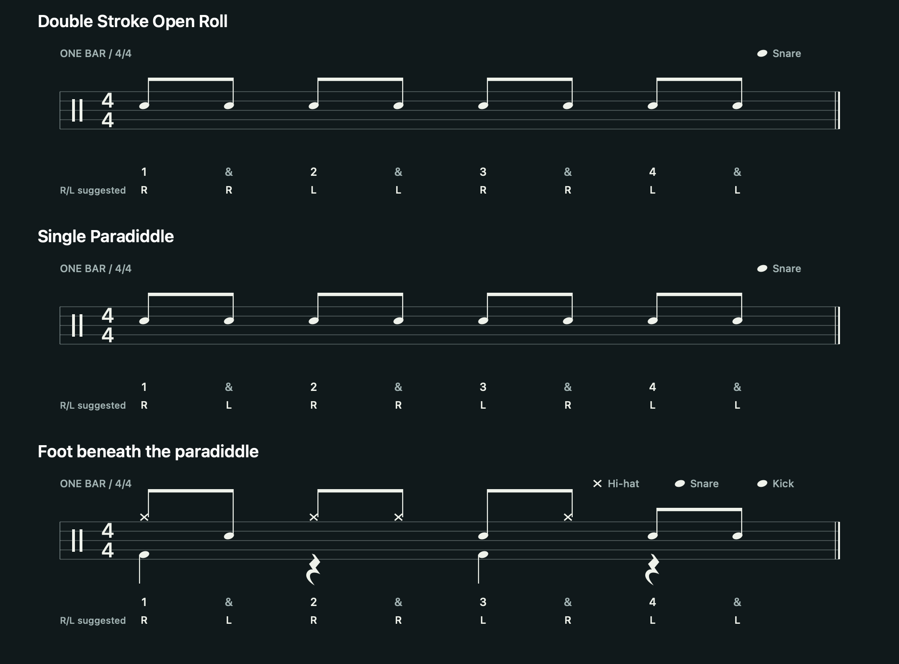

# drumx

A MIDI drum trainer for macOS and Windows. Practise timing, coordination, rudiments, and playing from memory with a rhythm-game highway and conventional drum notation.

[Downloads](https://github.com/claudfuen/drumx/releases) · [Build locally](#build-locally) · [Curriculum](docs/curriculum.md) · [Roadmap](docs/learning-milestones.md) · [Changelog](CHANGELOG.md)



*Native gameplay renderer with a scripted backbeat. Every instrument shares one timing line; hits are graded from captured timestamps.*

## Play, then reduce the guidance

| Guided practice | Memory practice |
| --- | --- |
|  |  |
| See the pattern, suggested sticking, hit captures, and early/late feedback. | Hide alternating bars while keeping the same playing surface. Strict click-only practice reveals timing results afterward. |

These gameplay images are reproducible offscreen captures from the native app's drawing code and scoring core, with scripted input. They are not photographs of a hardware playtest. The shared desktop port is still under visual review.

## Current course

**20 lessons in five chapters.** Each lesson includes counts, a notation study, a demonstration, repeated practice, and a short reading question.

| Chapter | Skills |
| --- | --- |
| **1. Pulse and counts** | Quarter notes, eighth notes, rests, and bass-drum placement |
| **2. Build your backbeat** | Hand/foot coordination, snare backbeat, and a complete groove |
| **3. Read, vary, and remember** | Single Stroke Roll, offbeat kick, space, and a short fill study |
| **4. Hands and rudiments** | Double Stroke Open Roll, Single Paradiddle, and their kit applications |
| **5. Make the groove your own** | Foot beneath a paradiddle, four-on-the-floor, pickup kick, and offbeat hi-hat |

The course currently uses one-bar quarter/eighth-note patterns. A normal practice block repeats for **16 bars**, about 53-80 seconds at the authored tempos. Longer musical phrases and sixteenth-note reading are the next curriculum gate.

| Lesson browser | Counts and sticking |
| --- | --- |
|  |  |

*Native component captures. The browser keeps one lesson featured and shows up to three chapters per page.*

Checkpoints use repeated comparable takes at a lesson's prescribed tempo. Each required instrument must contribute, so a strong hi-hat cannot mask a missing kick. Manual practice, stars, reading answers, and recall remain separate evidence. MIDI does **not** verify which hand played a note or establish physical technique. [Checkpoint rules and curriculum review](docs/curriculum-review.md)

## Downloads

[**Current release: preview-9ddcab48cd71**](https://github.com/claudfuen/drumx/releases/tag/preview-9ddcab48cd71) · [All releases](https://github.com/claudfuen/drumx/releases)

CI builds both platforms from the same commit, executes the exported applications' checks, verifies the pair, and publishes an experimental prerelease with a commit-bound tag, ZIPs, checksums, and a build manifest. Release downloads persist independently of expiring CI logs. Both exported apps passed **10,781 checks** in the [current verified run](https://github.com/claudfuen/drumx/actions/runs/34728349618).

| Package | Status |
| --- | --- |
| [**Download Mac / Apple Silicon**](https://github.com/claudfuen/drumx/releases/download/preview-9ddcab48cd71/Drumx-macos-arm64.zip) | Experimental shared app; ad-hoc signed, not notarized |
| [**Download Windows / x64**](https://github.com/claudfuen/drumx/releases/download/preview-9ddcab48cd71/Drumx-windows-x86_64.zip) | Experimental shared app; unsigned |
| **Native macOS app** | Current presentation baseline; build locally below |

Extract the complete package before launching. License files and third-party notices are included. The native Mac and shared apps use separate progress stores; the shared app still has [known feature and presentation gaps](docs/desktop-preview.md). Apple Developer ID signing and notarization require the Leap Labs credentials described in the [signing guide](docs/apple-signing.md).

## Build locally

The native Mac app requires **macOS 15+, full Xcode, and Python 3**.

```sh
git clone https://github.com/claudfuen/drumx.git
cd drumx
bash scripts/build-macos-lab.sh
open .build/DrumxLab.app
```

Use **Continue** to resume, **Learn** to browse lessons, or **Settings** to configure the kit and sound. On a new profile, Find the pulse starts at 60 BPM with a coached path to its 72 BPM checkpoint. Other lessons offer **Use checkpoint settings** to prepare their authored tempo and 16 guided bars.

### Songs on the native Mac app

Open **Songs** to browse your local library, import a song or scan a song directory, choose an authored drum difficulty, and play the complete song. The native player supports Clone Hero / YARG song folders, ZIPs, and SNG packages containing `song.ini`, `notes.mid` or `notes.chart`, and audio stems. Easy, Medium, Hard, and Expert appear when the chart supplies them.

Song play enables hi-hat, snare, kick, three toms, crash, and ride. It preserves chart tempo changes, song offsets, and pro-drum cymbal/tom distinctions. Songs use a separate library and do not award curriculum checkpoints. The shared Godot desktop preview does not yet expose this native Songs section.

Python 3 runs the bundled importer. Opus and Ogg audio require **FFmpeg** (`brew install ffmpeg`); decoded audio is cached locally. Imported charts and audio live in `~/Library/Application Support/Drumx/Songs`, outside the repository. Your original downloads remain in place. A chart without drums cannot be played as a drum song. [Song formats, mappings, and command-line import](docs/song-format.md)

| Input | Action |
| --- | --- |
| **A / S / Space** | Hi-hat / snare / kick; Shift makes a softer strike |
| **Arrow keys / Enter** | Select and activate menu actions |
| **Escape** | Close the current overlay, pause active playing, or return to the main menu |
| **Settings → Your kit** | Select MIDI input, inspect incoming notes, and map pad aliases |
| **Settings → Playing** | Enable optional drum navigation in supported menus |

Lessons score **hi-hat, snare, and kick**; native song play scores the full eight-part kit. The built-in monitor sounds cover the three lesson instruments using 24 acoustic recordings with four velocity layers and two variations per instrument. Use your kit's own sound for the additional pads. [Sample license and provenance](native/assets/BigRusty/README.md)

[First MIDI session](docs/first-kit-session.md) · [Controls and troubleshooting](docs/native-lab.md) · [Shared desktop build instructions](docs/desktop-preview.md)

## Current milestone

**M1: a complete beginner journey.** The course and practice loop are implemented; acceptance remains open.

| Gate | Required evidence |
| --- | --- |
| [Premium practice session](docs/premium-quality-gate.md) | A coherent 30-minute session, readable menus at supported sizes, reliable recovery, measured frame pacing, and physical-kit testing |
| [Curriculum C1](docs/curriculum-review.md) | Distinct lesson outcomes, faithful notation/audio/scoring, repeatable checkpoints, preserved progress, and observed learner comprehension |
| **Next: curriculum C2** | Two-/four-bar phrasing, sustained grooves with deliberate fills, and sixteenth-note literacy in both renderers |

## Development

The native Mac app uses **Swift/AppKit, CoreMIDI, and AVAudioEngine**. The shared desktop app uses **Godot with native MIDI/audio adapters**. Both use the portable **C++17 scoring core**; Swift-authored lessons are exported to verified JSON for the shared app. Rendering does not schedule the click or determine captured hit time.

```sh
bash scripts/test-native.sh
python3 -m unittest discover -s scripts/tests -p 'test_*.py'
```

[Architecture and platform contracts](docs/cross-platform.md) · [Release workflow](.github/workflows/desktop-preview.yml) · [Learning definitions](docs/learning-milestones.md)

## License

**Free for noncommercial use. Commercial uses outside the public license require a separate paid agreement with Claudio Fuentes.** Drumx is source-available under [PolyForm Noncommercial 1.0.0](LICENSE), not OSI open source. The license includes its own permitted-purpose and organization definitions. [Commercial licensing and third-party scope](LICENSE-GUIDE.md)
